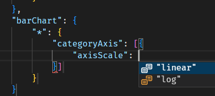

# Report theme JSON schema

This folder contains the authoritative JSON schema files for validating report themes in [Power BI Desktop](https://powerbi.microsoft.com/desktop/).  These schemas conform to the [Draft 7 specification](https://json-schema.org/specification-links.html#draft-7) of the [JSON schema spec](https://json-schema.org/specification.html).

Each file is tagged with the monthly release version of Desktop.  Inside the file, the `description` field describes the "exploration version" that the schema is valid for; this is generally matched with the release version of Power BI Desktop.

As part of our on-going effort to provide complete specification of our file format, subsequent versions of this schema will feature mostly additive changes as new formatting settings are added.

| Power BI Desktop version | Date     |  Exploration version | Schema name                  |
|--------------------------|----------|----------------------|------------------------------|
| 2.114.x.x                | Feb 2023 | 5.41                 | reportThemeSchema-2.114.json |
| 2.115.x.x                | Mar 2023 | 5.42                 | reportThemeSchema-2.115.json |

## Using the JSON schema

We anticipate two primary use cases for this schema.  One is for report theme authors, and the other is for report theme ISVs.  As always, you can find the [general documentation for report themes on the Microsoft docs site](https://learn.microsoft.com/power-bi/create-reports/desktop-report-themes).

Each formatting option under the `visualStyles` top-level property is tagged with the `title` and `description` that generally matches the English (en-US) translation text of the formatting property as it shows in the Formatting pane within Power BI Desktop.

### As a report theme author

If you are building custom report themes, you can use this schema to identify what formatting property defaults can be specified within your custom theme.

While [the Microsoft docs site](https://learn.microsoft.com/power-bi/create-reports/desktop-report-themes#report-theme-json-file-format) contains information about semantic colors, icons, and text styles, it does not specify all per-visual formatting settings.  As a general rule, all formatting that is controlled within the format pane within Power BI Desktop can also be specified with a different default by a custom theme.  The JSON schema helps to identify what these properties are called, their valid values, and how they should be specified.

Various IDEs can support in-line validation of JSON file authoring.  Here, we'll use the example of Visual Studio Code's [support for JSON schemas](https://code.visualstudio.com/docs/languages/json#_json-schemas-and-settings).

Download the appropriate schema file to your workstation, then create a blank JSON file alongside the downloaded file.  You can reference the schema from within your custom theme using the `"$schema"` property, like so:

You can also directly reference the "raw" HTML link of the schema in the repository, though note that you need an active internet connection and allow Visual Studio Code access to the remote resource.

Once you link up the schema, you can use autocomplete to understand the structure and available formatting options available.  Trigger autocomplete explicitly by using the key combination <kbd>Ctrl</kbd> + <kbd>Space</kbd>.  The description pop-up will show the formatting item's display name and description as they show in the Formatting pane, if available:

Validation errors will show as yellow error lines (much like bad grammar identified in Microsoft Word) that are required to be fixed to be valid report themes.

### As a report theme application builder (ISV)

Our schemas conform to [the draft-7 JSON schema spec](https://json-schema.org/specification-links.html#draft-7).  You may use this schema to help identify and document all available formatting to your clients, or use this schema in applications to programmatically generate custom theme JSON files.

## Use of the JSON theme schema

These schemas are used verbatim inside of Power BI Desktop to validate custom JSON theme when they are first imported to a report.  If the validation fails, Power BI Desktop will reject the custom theme.

The error messges that we generate in Power BI Desktop are based on [the Ajv library](https://ajv.js.org/); you may get different error messages if you use a different JSON schema validator.

## Limitations

We currently do not support the following items in the custom report theme JSON, though we may add support given feedback:
* References to dynamic content that reports support (other than `ThemeDataColor` expressions), e.g. `expr: { SparklineData: { ... } }`
* References from formatting colors to semantic colors, e.g. `"foreground"` for a `Fill` type.
* References to model-specific items, such as _conditional formatting_ that depends on fields or data values

### Known issues
The following describes known issues in previously-released reportThemeSchema JSON files.  "Open issues" are not prioritized for quick fixing and will be priotized as time allows.

#### February 2023 (2.114)
Issues in the February 2023 release (2.114) and fixed in the March 2023 release (2.115) of Power BI Desktop:
* The top-level `icons` schema only supports icons defined in a list, not as a named object list.
* Certain "verticalAlignment" formatting options may only accept horizontal alignment options such as "left", "center", and "right" instead of "top", "middle", and "bottom".
* Eight-digit hex colors were not allowed for `Fill` definitions, where the last octet describes alpha transparency, e.g.: `#0000ff7f` -> `rgba(0, 0, 255, 0.5)`

#### Open issues

* Enumeration values are not clearly defined such as "labelOrientation"; [consider using enum descriptors using `const`](https://github.com/json-schema-org/json-schema-spec/issues/57#issuecomment-247861695)
* Defining a default "canvas size" doesn't work; see [Issue #51](https://github.com/microsoft/powerbi-desktop-samples/issues/51).

## Comments or suggestions

Please leave suggestions and tag @yelper in your issue that you open on this repository.
